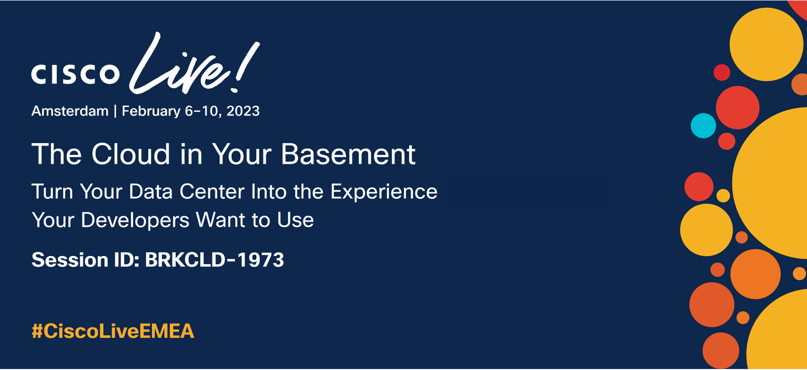
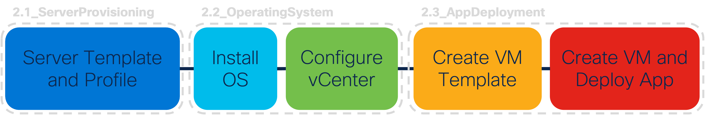

## Source Code for the Cisco Live EMEA Session BRKCLD-1973 in Amsterdam on Feb 09, 2023.

This repository is the source code for the demos shown in the BRKCLD-1973 session at Cisco Live EMEA in Amsterdam, Feb 06 - 10. The session recording and presentation slides are available [here](https://www.ciscolive.com/on-demand/on-demand-library.html?search=brkcld-1973#/session/1675722350384001tsG3).

The goal of the session is to demonstrate how to make on-premises infrastructure resources available programatically. Workflows that are demonstrated include a Linux app deployment in Azure, and how the same app can be deployed on UCS infrastructure using Intersight and vSphere. Both workflows are based on Terraform.

The source code to the sample app that is being deployed in the demo can be found [here](https://github.com/jara-o/BRKCLD1973-SampleApp). 

## Solution Components
* Cisco Intersight
* VMware vSphere
* Hashicorp Terraform

## Repository Structure
### 1_Azure

In the directory labeled `1_Azure`, you can find the source code to create a Linux-based application as part of an Azure App Service plan. The documentation to the Azure Terraform provider that was used can be found [here](https://registry.terraform.io/providers/hashicorp/azurerm/3.42.0).

### 2_Intersight

In the directory labeled `2_Intersight`, you can find sub-directories based on the five different steps referenced above and that are required to deploy an app on-premises. Each sub-directory includes its own source to allow for a simple step-by-step replication. The documentation to the Intersight Terraform provider that was used in step 1 and 2 can be found [here](https://registry.terraform.io/providers/CiscoDevNet/intersight/latest), and to the vSphere Terraform provider used in step 3 and 5 can be found [here](https://registry.terraform.io/providers/hashicorp/vsphere/latest). Step 4 makes use of Hashicorp Packer and the vSphere-iso builder, for which the documentation can be found [here](https://developer.hashicorp.com/packer/plugins/builders/vsphere/vsphere-iso).

## Prerequisites
- **Terraform**: Ensure to have Terraform installed following [these instructions](https://developer.hashicorp.com/terraform/tutorials/aws-get-started/install-cli).
- **Intersight**: 
  - Create an account with Intersight following [these instructions](https://intersight.com/help/saas/getting_started/create_cisco_intersight_account).
  - Claim an Intersight managed UCS domain following [these instructions](https://intersight.com/help/saas/getting_started/claim_targets#target_claim_in_intersight_managed_mode).
  - Generate an API key following [these instructions](https://intersight.com/apidocs/introduction/security/#generating-api-keys).
- **vCenter**: Ensure to have a vCenter instance available.

## Installation

1. Clone this repository.

        $ git clone https://github.com/jara-o/BRKCLD1973.git
    Alternatively, you can also download the code as a .zip [here](https://github.com/jara-o/BRKCLD1973/archive/refs/heads/master.zip).

### For Steps 1, 2.1, 2.2.1, 2.2.2, and 2.3.2 (based on Terraform)

2. In each sub-directory, open the `terraform.tfvars` and add the variables for your environment.

3. Open a  terminal and navigate to the root of each subdirectory (where the `terraform.tfvars` file is located). 

4. Run `terraform init`.

5. Run `terraform apply` and enter `yes` to run the plan.

### For Step 2.3.1 (based on Packer)

2. Open the `variables.pkrvars.hcl` and `vsphere.pkrvars.hcl` files and add the variables for your environment. Also open the `cloud-init/user-data` file and add the missing information. 

3. Install Packer following [these instructions](https://developer.hashicorp.com/packer/tutorials/docker-get-started/get-started-install-cli).

4. Open a terminal and navigate to the root of the directory.

5. Run `packer build --var-file=variables.pkrvars.hcl --var-file=vsphere.pkrvars.hcl ubuntu-22.04.pkr.hcl`.

## Contacts
* Jara Osterfeld (josterfe@cisco.com)